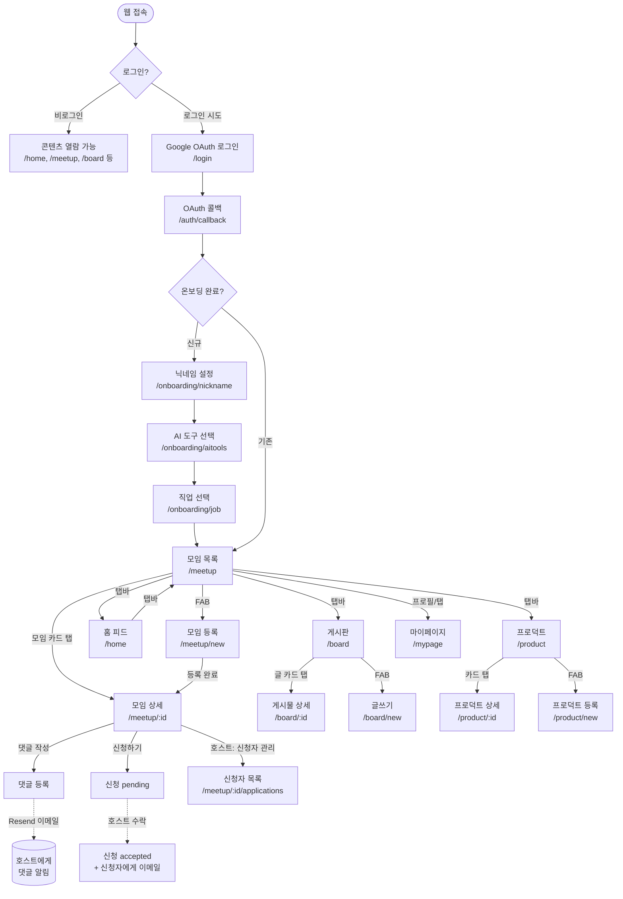

# 같이바코할사람 — 화면 흐름도 & 개발 현황

> 동반 문서: `prd.md`, `CLAUDE.md`
> 플랫폼: 웹앱 (Vite + React) · 인증: Google OAuth (Supabase Auth) · 배포: Vercel
> 최종 업데이트: 2026-06-13

---

## 1. 화면 흐름도



---

## 2. 화면별 핵심 정보

| 화면 | 경로 | 컴포넌트 | 로그인 필요 | 핵심 역할 |
|---|---|---|---|---|
| Google 로그인 | `/login` | LoginScreen | — | Google OAuth 진입점 |
| OAuth 콜백 | `/auth/callback` | AuthCallbackScreen | — | 세션 확인 → 온보딩 or `/meetup` |
| 닉네임 설정 | `/onboarding/nickname` | OnboardingNicknameScreen | — | 고유 닉네임 등록 |
| AI 도구 선택 | `/onboarding/aitools` | OnboardingAIToolsScreen | — | 사용 AI 도구 선택 |
| 직업 선택 | `/onboarding/job` | OnboardingJobScreen | — | 직업 선택 → `/meetup` 이동 |
| 홈 통합 피드 | `/home` | FeedScreen | ❌ | 모임+게시판+프로덕트 혼합 피드, Realtime |
| 모임 목록 | `/meetup` | HomeScreen | ❌ | 모임 전용 리스트, 지역 필터, 정렬, Realtime |
| 모임 상세 | `/meetup/:id` | MeetupDetailScreen | ❌ (작성은 ✅) | 모임 정보 + 댓글 + 신청 |
| 모임 등록 | `/meetup/new` | MeetupNewScreen | ✅ | 모임 개설 폼 |
| 모임 수정 | `/meetup/:id/edit` | MeetupEditScreen | ✅ (호스트만) | 모임 수정 |
| 신청자 관리 | `/meetup/:id/applications` | ApplicationsScreen | ✅ (호스트만) | 신청 수락/거절 |
| 게시판 목록 | `/board` | BoardScreen | ❌ | 카테고리 필터, 정렬, Realtime |
| 게시물 상세 | `/board/:id` | BoardPostDetailScreen | ❌ (작성은 ✅) | 게시물 + 댓글 |
| 글쓰기 | `/board/new` | BoardPostNewScreen | ✅ | 게시글 작성 |
| 글 수정 | `/board/:id/edit` | BoardPostEditScreen | ✅ (작성자만) | 게시글 수정 |
| 프로덕트 목록 | `/product` | ProductScreen | ❌ | 프로젝트 쇼케이스 목록 |
| 프로덕트 상세 | `/product/:id` | ProductDetailScreen | ❌ (좋아요/저장은 ✅) | 프로젝트 상세 |
| 프로덕트 등록 | `/product/new` | ProductNewScreen | ✅ | 프로젝트 등록 |
| 프로덕트 수정 | `/product/:id/edit` | ProductEditScreen | ✅ (작성자만) | 프로젝트 수정 |
| 마이페이지 | `/mypage` | MyPageScreen | ✅ | 프로필/내 활동 관리 |
| 타유저 프로필 | `/user/:nickname` | UserProfileScreen | ❌ | 타유저 공개 프로필 |
| 검색 | `/search` | SearchScreen | ❌ | 모임/게시판 통합 검색 |
| 공지사항 | `/notice`, `/notice/:id` | NoticeScreen/Detail | ❌ | 공지 목록/상세 |
| 서비스 소개 | `/about` | AboutScreen | ❌ | 랜딩/소개 |

---

## 3. 구현 현황 (마일스톤)

### ✅ M1. 인증 & 온보딩 — 완료

- [x] Google OAuth 연동 (Supabase Auth)
- [x] 신규/기존 유저 분기 (profiles 테이블 유무 확인)
- [x] 닉네임 입력 + 중복 검사
- [x] AI 도구 선택
- [x] 직업 선택
- [x] 온보딩 완료 후 `/meetup` 리다이렉트
- [x] 비로그인 열람 허용, 작성/신청 시 로그인 유도

### ✅ M2. 데이터 모델 & Supabase 설정 — 완료

- [x] profiles, meetups, comments, meetup_applications 스키마
- [x] board_posts, board_comments 스키마
- [x] showcase, showcase_likes, showcase_saves 스키마
- [x] notifications, notices 스키마
- [x] RLS 정책 설정
- [x] Supabase Realtime 채널 (meetups, board_posts)

### ✅ M3. 홈 & 모임 목록 — 완료

- [x] 홈 통합 피드 (`/home`): 모임 + 게시판 + 프로덕트 혼합
- [x] 홈 우측 패널: 내 신청 현황 + 호스트 대기 신청
- [x] 모임 목록 (`/meetup`): 모임 전용 리스트
- [x] 지역 필터 칩 (전체 / 내 지역 / 추가 지역)
- [x] 정렬: 최신순 / 임박순
- [x] Supabase Realtime 실시간 반영
- [ ] **지도뷰 (2차 MVP)**: 네이버 지도 웹 SDK v3, 리스트/지도 토글

### ✅ M4. 모임 등록/수정/삭제 — 완료

- [x] 모임 등록 폼 (제목/설명/장소/날짜·시간/모집 인원/지역)
- [x] 모임 수정
- [x] 모임 삭제 (호스트 전용)

### ✅ M5. 모임 상세 + 댓글 + 신청 — 완료

- [x] 모임 정보 표시 (조회수 포함)
- [x] 자유 댓글 + 대댓글
- [x] 신청하기 → pending
- [x] 신청자 관리 화면 (`/meetup/:id/applications`)
- [x] 수락/거절 처리

### ✅ M6. 이메일 알림 (Resend) — 완료

- [x] 댓글 발생 → 호스트 이메일
- [x] 신청 수락 → 신청자 이메일 (호스트 연락처 포함)
- [x] Supabase Edge Function에서 Resend API 호출

### ✅ M7. 게시판 — 완료

- [x] 게시판 목록 (카테고리 필터, 정렬)
- [x] 게시물 상세 + 댓글/대댓글
- [x] 글쓰기/수정/삭제
- [x] Supabase Realtime 실시간 반영

### ✅ M8. 프로덕트 쇼케이스 — 완료

- [x] 프로덕트 목록
- [x] 프로덕트 상세 (좋아요/저장)
- [x] 프로덕트 등록/수정/삭제

### ✅ M9. 부가 기능 — 완료

- [x] 마이페이지 (프로필 수정, 내 모임/게시글/프로덕트)
- [x] 타유저 프로필 페이지
- [x] 앱 내 알림 (알림 벨, 읽음 처리)
- [x] 검색
- [x] 공지사항
- [x] 서비스 소개 (`/about`)
- [x] Vercel 배포 (https://vibetogether.vercel.app)

---

## 4. 다음 할 일 (2차 MVP)

### 지도뷰 (최우선)

- [ ] 네이버 지도 웹 SDK v3 키 발급 및 연동
- [ ] `/meetup`에 지도/리스트 토글 UI 추가
- [ ] 모임 핀 렌더 (모임별 lat, lng 필드 활용)
- [ ] 핀 탭 → 하단 요약 카드 (제목/장소/시간/모집 인원)
- [ ] 거리순 정렬 (지도뷰 기준)

### 기타 개선

- [ ] 이미지 업로드 (모임 썸네일, 프로필 사진) — Supabase Storage
- [ ] 모임 수정 시 신청자에게 변경 알림 이메일
- [ ] 무한 스크롤 / 페이지네이션 (현재는 전체 로드)

---

## 5. 의존성 & 주의사항

- **지도 연동 시 주의**: 네이버 지도 API는 Web 서비스 URL을 등록해야 함. Vercel 도메인 추가 필요.
- **Supabase Edge Function**: `RESEND_API_KEY`는 Supabase 대시보드 Edge Function 환경변수에 설정.
- **환경변수**: `VITE_SUPABASE_URL`, `VITE_SUPABASE_ANON_KEY`는 Vercel 프로젝트 설정에도 등록되어 있어야 함.
- **RLS**: 새 테이블 추가 시 반드시 RLS 정책도 함께 작성.

### Supabase Realtime 설정 (새 환경 구성 시 필수)

새 Supabase 프로젝트나 브랜치를 만들 때 Realtime이 자동으로 켜지지 않음. 아래 SQL을 직접 실행해야 함:

```sql
-- Realtime publication에 테이블 추가
ALTER PUBLICATION supabase_realtime ADD TABLE meetups;
ALTER PUBLICATION supabase_realtime ADD TABLE board_posts;

-- view_count-only UPDATE를 클라이언트에서 감지하려면 REPLICA IDENTITY FULL 필요
-- (설정 없이도 INSERT/DELETE 실시간 반영은 동작함)
ALTER TABLE meetups REPLICA IDENTITY FULL;
ALTER TABLE board_posts REPLICA IDENTITY FULL;
```

`REPLICA IDENTITY FULL` 없이는 UPDATE 이벤트의 old 값을 알 수 없어 view_count 필터가 동작하지 않음. 이 경우 모든 UPDATE가 목록 재조회를 트리거함.

### 지역 ID 형식

지역은 `"서울/강남구"` 형식(`city/name`)으로 저장. `src/lib/regions.ts`의 `regionKey()`, `regionDisplay()`, `parseRegionKey()` 헬퍼 사용.
표시할 때는 항상 `regionDisplay(key)`를 거쳐 이름만 보여줌.
