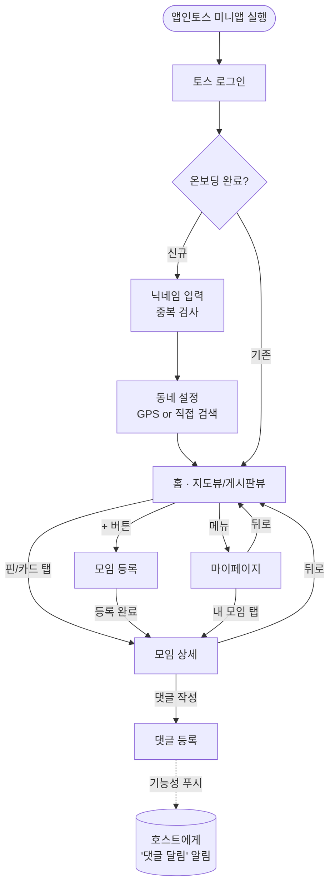
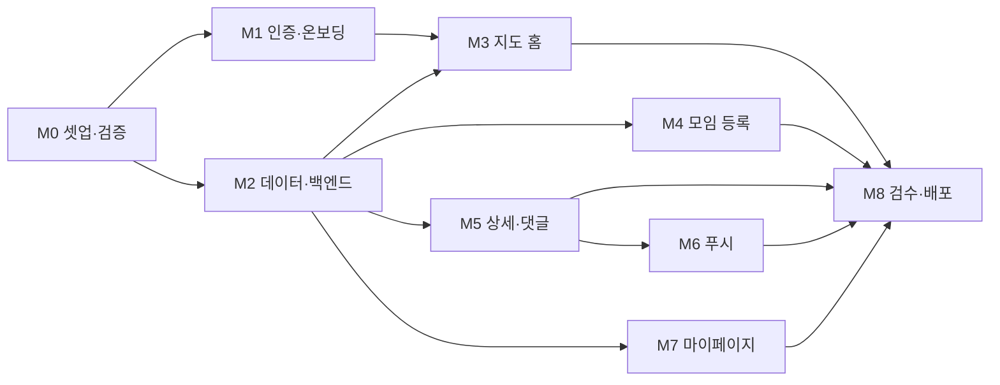

# 같이바코할사람 — 화면 흐름도 & 개발 태스크 분해 (MVP)

> 동반 문서: `모각작 모집 서비스 MVP PRD` (v0.5)
> 플랫폼: 앱인토스(토스 미니앱, WebView/Granite) · 지도: 네이버 지도 웹 SDK · 로그인: 토스 로그인 · 알림: 앱인토스 푸시
> 작성일: 2026-06-02

---

## 1. 화면 흐름도

### 화면별 핵심
| 화면 | 핵심 역할 | 주요 액션 |
|---|---|---|
| 토스 로그인 | 인증 | 토스 로그인 → `x-toss-user-key` 확보 |
| 온보딩(닉네임) | 고유 닉네임 등록 | 입력 → 중복 검사 → 통과 |
| 온보딩(동네) | 활동 지역 설정 | GPS 허용 자동설정 / 거부 시 동네 검색 |
| 홈(지도/게시판) | 주변 모임 탐색 | 지도뷰·게시판뷰 토글, 정렬, + 등록 |
| 모임 상세 | 정보 + 댓글 | 댓글 작성(참여 카운트 없음), 호스트는 수정/삭제 |
| 모임 등록 | 모임 개설 | 제목·장소·시간·인원 입력 |
| 마이페이지 | 프로필 + 내 활동 | 프로필, 내가 쓴 글, 댓글 단 글 보기 |

---

## 2. 개발 태스크 분해

진행 순서는 **마일스톤(M0→M8)** 기준이며, M0의 기술 검증 결과에 따라 이후 일정이 갈릴 수 있어 가장 먼저 둡니다.

### M0. 프로젝트 셋업 & 기술 검증 (스파이크) — *가장 먼저*
- [ ] 앱인토스 Granite 프로젝트 스캐폴딩, 샌드박스 앱 설치 및 로컬 서버 연결
- [ ] `granite.config.ts` 기본 설정 (미니앱 이름/스킴 `intoss://...`)
- [ ] **🔴 [최우선] 네이버 지도 타일 CSP 검증**: 샌드박스 WebView에서 네이버 지도 JS API v3로 지도 타일(map.pstatic.net)이 실제로 렌더되는지 확인 → 별도 검증 가이드 4장 참고
  - [ ] 막힐 경우 → 타일 도메인 화이트리스트 가능한지 토스 측 문의
  - [ ] 해결 불가 시 → **대안 지도(카카오맵 등) 검토 후 결정**
- [ ] 외부 스킴 호출(`window.location.href`) 제한 확인 — 지도/외부 연동은 웹 SDK·앱인토스 API로만
- [ ] 백엔드 스택/호스팅, DB 선택 및 기본 배포 파이프라인

> 이 단계의 산출물: "네이버 지도 그대로 가도 되는가?"에 대한 Yes/No. 여기서 막히면 PRD의 지도 결정을 갱신.

### M1. 인증 & 온보딩
- [ ] 토스 로그인 연동 → `x-toss-user-key` 수신/저장
- [ ] 신규/기존 사용자 분기 (온보딩 완료 플래그)
- [ ] 닉네임 입력 화면 + **중복 검사 API**(고유 제약)
- [ ] 동네 설정: GPS 권한 요청 → 현재 위치 역지오코딩으로 동네 표시
- [ ] GPS 거부/실패 fallback: 동네 직접 검색·선택
- [ ] User 레코드 생성/갱신

### M2. 데이터 모델 & 백엔드 기본
- [ ] 스키마: `User / Meetup / Comment` (PRD 8장 기준, 댓글은 참여 집계 없는 일반 댓글)
- [ ] 모임 CRUD API (생성/조회/수정/삭제)
- [ ] 댓글 생성/목록 API (생성 시 호스트 푸시 트리거 연계 → M6)
- [ ] 지역(region) 기준 모임 필터 쿼리

### M3. 홈 · 모임 탐색 (지도뷰 / 게시판뷰)
- [ ] 상단 **지도뷰 ↔ 게시판뷰 토글** (기본 지도뷰)
- [ ] **지도뷰**: 네이버 지도 웹 SDK 초기화 + 현재 동네 중심
- [ ] 지도뷰: 주변 모임 핀 렌더 + 핀 탭 시 하단 요약 카드(제목/장소/시간/모집 M명)
- [ ] **게시판뷰**: 모임 카드 피드 세로 스크롤(제목/장소/시간/모집 M명/호스트/거리)
- [ ] 게시판뷰: 카드 탭 → 모임 상세
- [ ] 정렬: 최신순 / 임박순 / 거리순 (두 뷰 공통)
- [ ] 상단 "내 동네" 표시 + 변경, 우하단 + 버튼 (두 뷰 공통)

### M4. 모임 등록
- [ ] 등록 폼: 제목, 설명(선택), 장소, 날짜·시간, 모집 인원
- [ ] 장소 지정: 지도에서 핀 찍기 + 장소 검색(네이버 지역/장소 검색)
- [ ] 등록 시 호스트 동네 기준 노출, 등록 후 상세로 이동

### M5. 모임 상세 + 댓글
- [ ] 상세 정보 표시(제목/설명/장소/시간/호스트/모집 M명)
- [ ] 댓글 작성/목록 (참여 카운트 없음, 자유 댓글)
- [ ] 댓글 작성 시 호스트 푸시 트리거 (→ M6)
- [ ] 호스트용 수정/삭제

### M6. 푸시 알림 (앱인토스)
- [ ] **푸시 메시지 템플릿 문구 확정** (예: "'{모임 제목}'에 새 댓글이 달렸어요")
- [ ] **템플릿 검수 신청** (영업일 약 2~3일 — 일찍 신청)
- [ ] 트리거: 새 댓글 발생 → 모임 호스트 `x-toss-user-key`로 기능성 푸시 발송(send-message)
- [ ] 알림 수신 거부 경로 제공(가이드 권장)
- [ ] 발송 로깅/실패 처리

### M7. 마이페이지 (간단)
- [ ] 프로필: 닉네임 / 동네 표시
- [ ] 내가 작성한 글(내 모임) 목록
- [ ] 댓글 단 글(참여한 모임) 목록
- [ ] 닉네임·동네 수정 — 닉네임 수정 시 중복 검사 재적용

### M8. 검수 & 배포
- [ ] 콘텐츠 가이드(혐오/차별 등) 준수 점검 + 검수 가이드 최종 확인(TDS 등 포함)
- [ ] 미니앱 검수 제출 (푸시 템플릿 검수 완료 선행)
- [ ] 시드 지역(강남·성수·판교 인접) 초기 데이터/홍보 준비
- [ ] 출시 후 핵심 지표 트래킹 셋업(모임 개설 수, 모임당 댓글 수, 댓글 발생 모임 비율, WAU)

---

## 3. 의존성 · 크리티컬 패스

병렬로 갈 수 있는 작업이 많지만, 아래 2개는 **리드타임/리스크가 있어 먼저 착수**해야 막판 병목을 피합니다.

1. **🔴 네이버 지도 타일 CSP 검증 (M0) — 지금 단계 최우선.** 막히면 지도 선택 자체가 바뀌므로 모든 지도 작업의 선행 조건. (검증 방법은 4장)
2. **푸시 템플릿 검수 (M6)** — 2~3 영업일 소요 → 문구만 확정되면 개발 중간에 미리 신청.

> 검수 제출 시점 참고: 비게임 WebView 미니앱은 TDS(토스 디자인 시스템)가 검수 기준에 포함된다는 문서가 있으니, **출시 직전 검수 가이드에서 한 번 더 확인**하면 됩니다. (지금 설계 단계의 우선순위는 아님)

---

## 4. 🔴 [최우선] 네이버 지도 사용 가능 검증 (Runbook)

**목표:** "앱인토스 WebView 안에서 네이버 지도가 배경 타일까지 정상으로 보이는가?"를 코딩 본격 착수 전에 Yes/No로 판정.

**왜 일반 브라우저가 아니라 샌드박스인가:** 보고된 차단은 앱인토스 WebView의 CSP에서 발생함. 일반 크롬에서는 잘 보여도 샌드박스 WebView에서는 막힐 수 있어, **반드시 샌드박스 앱에서** 확인해야 함.

### 검증 절차
1. 네이버 클라우드 플랫폼에서 지도 API 키 발급 (Web 서비스 URL 등록 포함)
2. 아래 최소 테스트 페이지를 로컬/배포 서버에 올림
3. **샌드박스 앱에서 미니앱 스킴으로 접속**해 페이지 로드
4. 화면 상단 배너의 판정 결과 + 지도 배경이 실제로 채워지는지 육안 확인

### 판정 기준
| 결과 | 의미 | 다음 액션 |
|---|---|---|
| ✅ 타일 로드 성공 + 지도 배경 표시 | 네이버 지도 그대로 진행 가능 | M3 정상 진행 |
| ❌ 타일 onerror / 배경 회색 | CSP에 타일 도메인 차단 | ①토스에 타일 도메인 화이트리스트 문의 → ②안 되면 카카오맵 등 대안 검토 |

### 최소 테스트 스니펫
> 별도 파일 `naver-map-csp-test.html`로 제공. 키만 교체 후 샌드박스에서 로드.
> 지도 렌더와 별개로, 타일 이미지 도메인(map.pstatic.net) 로드를 직접 프로빙해 PASS/FAIL을 표시함.

---

## 5. 확인 필요 / 외부 의존 (착수 전 체크)
- 네이버 지도 타일 도메인 CSP 허용 여부 (토스 문의)
- 네이버 클라우드 플랫폼 지도/검색 API 키 발급 및 사용량/요금 확인
- 앱인토스 푸시 send-message API 사용 조건(사업자 등록 필요 여부 등) 확인
- 위 항목들은 현재 앱인토스/네이버 공식 문서 기준 재확인 권장 (정책은 변동 가능)
